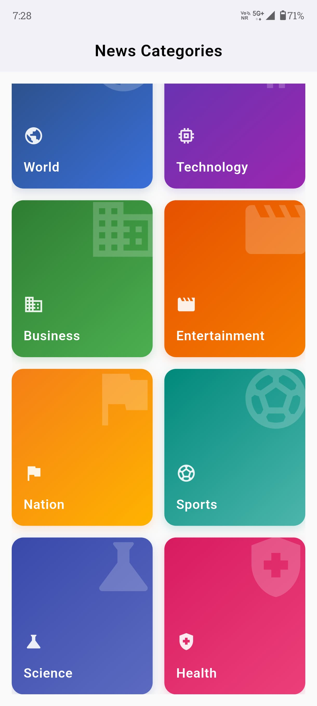

# 📰 Newstoday – Flutter News Aggregator App

**Newstoday** is a clean and responsive Flutter app that aggregates the latest headlines from Google News RSS feeds, fetches related topic images using the Pexels API, and displays news articles in a modern card-based layout. Built with a developer-first mindset, this app is perfect for portfolios and showcases API integration, XML parsing, UI responsiveness, and asynchronous operations in Flutter.

---

## ✨ Features

* 🔍 Browse real-time news by categories (like Technology, Sports, etc.)
* 📸 Auto-fetch relevant topic images via Pexels API
* 🧞 Parses XML data from Google News RSS feeds
* 🖼 Responsive image + text layout with fallback placeholders
* ⚡ Lightweight, clean architecture using Flutter best practices
* 🔗 Open articles in a browser using `url_launcher`

---

## 📸 Screenshots

To ensure a consistent visual experience, all screenshots below are resized to the same dimensions (e.g., 400x800px).

| Home                                                            | Navigation                                                            | Article View                                                    | Progress Indicator                                                            |
| --------------------------------------------------------------- | --------------------------------------------------------------------- | --------------------------------------------------------------- | ----------------------------------------------------------------------------- |
|  |  |  |  |

---

## 🧠 How it Works

### 🔗 Fetching Google News RSS

In the app, news is loaded by dynamically building a Google News RSS feed URL:

```dart
final rssUrl = 'https://news.google.com/news/rss/headlines/section/topic/$encodedTopic';
```

Then, the RSS feed is parsed using Dart's XML parser to extract title, description, and publication date:

```dart
final document = XmlDocument.parse(response.body);
final items = document.findAllElements('item');
```

### 📷 Fetching Images from Pexels API

Each topic is also searched on the [Pexels API](https://www.pexels.com/api/) to fetch related images:

```dart
final url = 'https://api.pexels.com/v1/search?query=\${Uri.encodeComponent(topic)}&per_page=\$maxImages';
```

If no API key is provided or the call fails, a placeholder image is used:

```dart
final imageUrl = imageUrls.isNotEmpty
  ? imageUrls[index++ % imageUrls.length]
  : 'https://via.placeholder.com/600x400?text=\${Uri.encodeComponent(topic)}';
```

---

## 🧰 Tech Stack

| Tech              | Usage                         |
| ----------------- | ----------------------------- |
| **Flutter**       | UI + App Logic                |
| **http**          | Network calls to RSS & Pexels |
| **xml**           | RSS feed parsing              |
| **url\_launcher** | Open article in browser       |
| **Pexels API**    | Topic image fetching          |

---

## 📅 Download APK

> Download the latest APK from the [Releases Page](https://github.com/yourusername/newstoday/releases/latest)

---

## 📲 Installation

1. Click the download link above.
2. On your Android device, enable "Install Unknown Apps".
3. Open the APK and install it.
4. Launch and enjoy the headlines!

---

## 🔐 API Key Note

To enable real image search:

* [Get a free API key from Pexels](https://www.pexels.com/api/)
* Paste your key into `fetchPexelsImages()` function in the app:

```dart
const apiKey = 'YOUR_API_KEY_HERE';
```

---

## 🚀 Roadmap / Ideas

* ✨ Add custom search
* 🌐 Multi-language support
* 🌃 Dark Mode toggle
* 🗂 Bookmark functionality

---

## 👤 Author

**Saratchandra Raju Sarikonda**
[LinkedIn](https://www.linkedin.com/in/s-saratchandra-raju/) • [Portfolio](https://saratchandra-raju-sarikonda.vercel.app/)

---

## ⚠️ Disclaimer

This is a demo app for educational and portfolio purposes. All content belongs to their respective publishers and image providers.

---

## 📜 License

This project is licensed under the Creative Commons Attribution-NonCommercial-NoDerivatives 4.0 International (CC BY-NC-ND 4.0) License.

You are free to:

Share — Copy and redistribute the material in any medium or format.

Under the following terms:

Attribution — You must give appropriate credit.

NonCommercial — You may not use the material for commercial purposes.

NoDerivatives — If you remix, transform, or build upon the material, you may not distribute the modified material.

📄 Read the full license: CC BY-NC-ND 4.0
